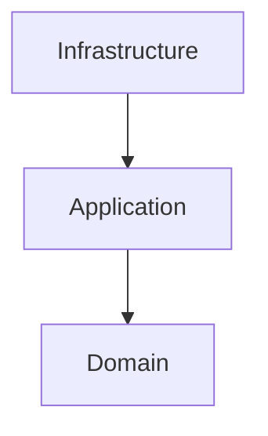
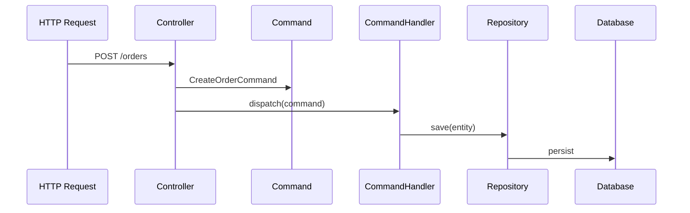

# Architecture

Laravel DDD Generator enforces a **modular, layered architecture**
based on **Domain-Driven Design (DDD)** and **CQRS**.

Each module is fully isolated and self-contained.

---

## Module structure

```
Modules/<ModuleName>
├── Domain
│   ├── Entities
│   ├── ValueObjects
│   ├── Events
│   └── Repositories
│
├── Application
│   ├── Commands
│   ├── CommandHandlers
│   ├── Queries
│   ├── QueryHandlers
│   ├── DTO
│   └── UseCases
│
├── Infrastructure
│   ├── Persistence
│   │   ├── Models
│   │   ├── Mappers
│   │   └── Repositories
│   │
│   └── Http
│       ├── Controllers
│       ├── Requests
│       ├── Resources
│       └── routes.php
│
└── <Module>ServiceProvider.php
```

---

## Layer responsibilities

### Domain
- Pure PHP
- No Laravel dependencies
- Business rules and invariants only

### Application
- Coordinates use cases
- Implements CQRS
- Depends only on Domain interfaces

### Infrastructure
- Laravel-specific code
- HTTP, Eloquent, routing
- Implements repositories

---

## Dependency rule

All dependencies point inward:



- Domain depends on nothing
- Application depends on Domain
- Infrastructure depends on Application and Domain

---

## CQRS flow



---

## Service Provider

Each module has its own Service Provider:

```
Modules/Order/OrderServiceProvider.php
```

Responsibilities:
- Bind repository interfaces to implementations
- Load module routes
- Keep module fully isolated

---

## Architectural rules

- ❌ No Eloquent in Domain
- ❌ No HTTP in Application
- ❌ No global routes
- ✅ Explicit dependencies
- ✅ Idempotent generators

---

## Why this architecture?

This approach is designed for:
- Large teams
- Long-living projects
- Complex business domains

It avoids:
- God controllers
- Hidden dependencies
- Framework lock-in
