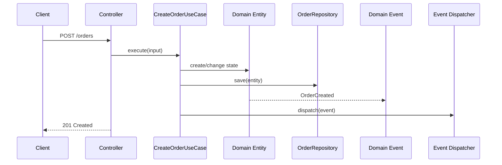
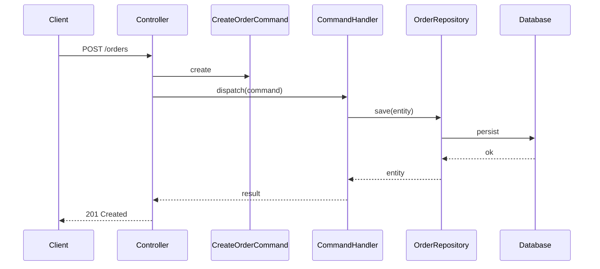
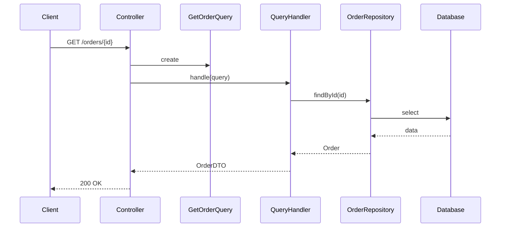
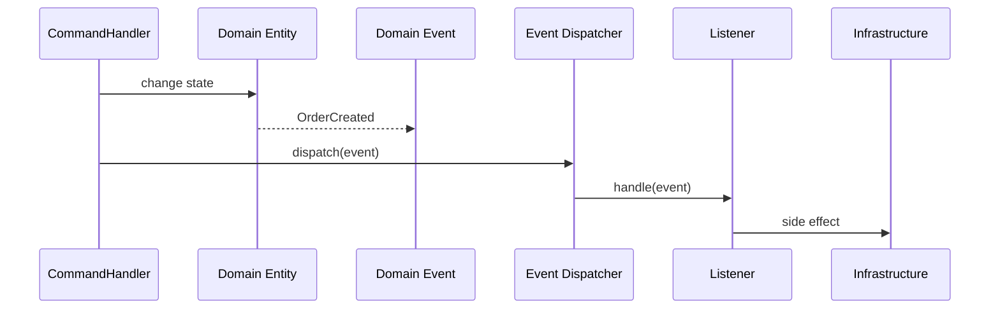
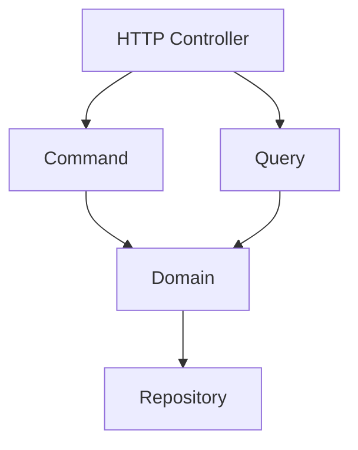
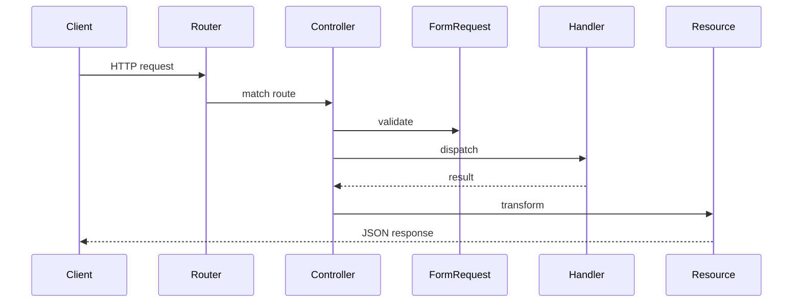
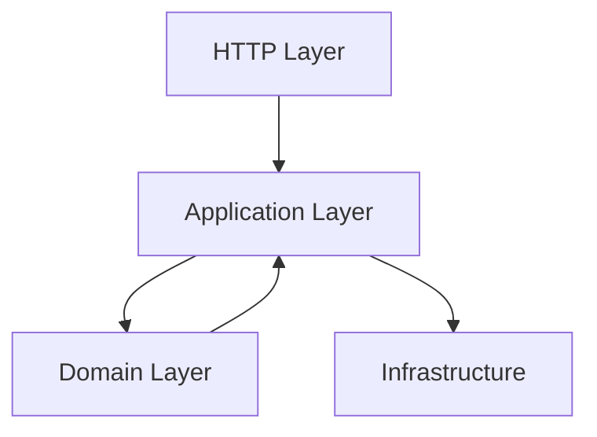

# Architecture & Flow Diagrams

---

## Use Case flow diagram

## CQRS — Write flow (Command)

---

## CQRS — Read flow (Query)

---

## Domain Events — Flow

---

## CQRS — Dependency boundaries

---

## HTTP — Request lifecycle

---

## Layered architecture overview

